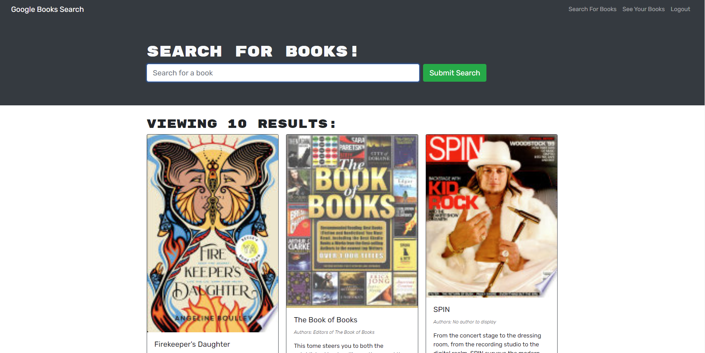

# Book library

## About

This is a Library for books that uses graphql and JWT tokens to run it locally run npm install and npm run develop

## Link

Make sure to click [here](https://bookapp123123.herokuapp.com/) to view a live copy of the portfolio.

## Screenshot

##Questions

You can reach the creator of this project at:
[Github](http://github.com/Travis-Anderson023)
[email](mailto:tsanderson.023@gmail.com)